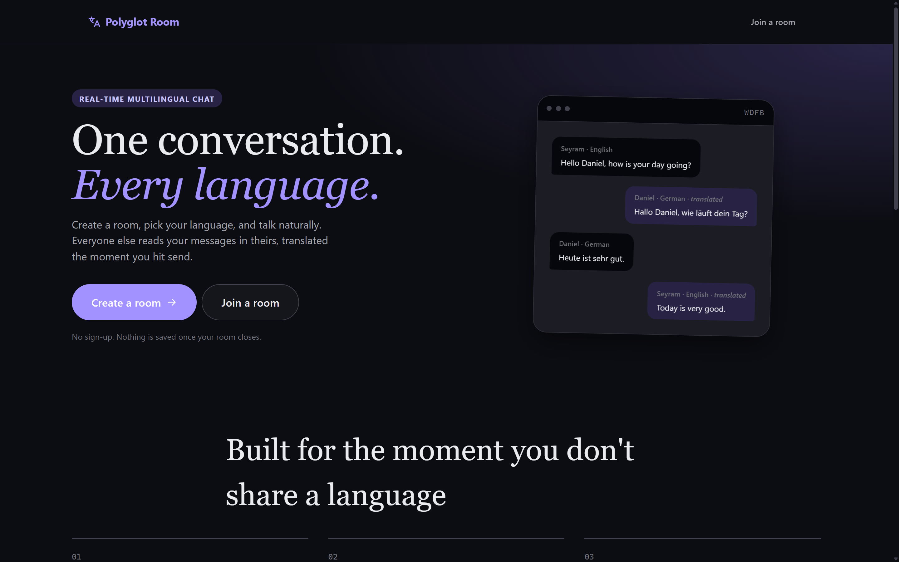
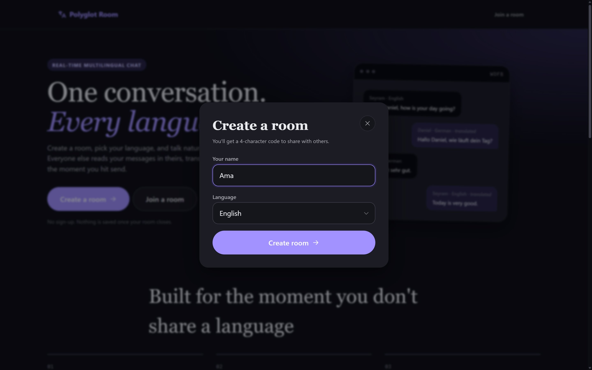
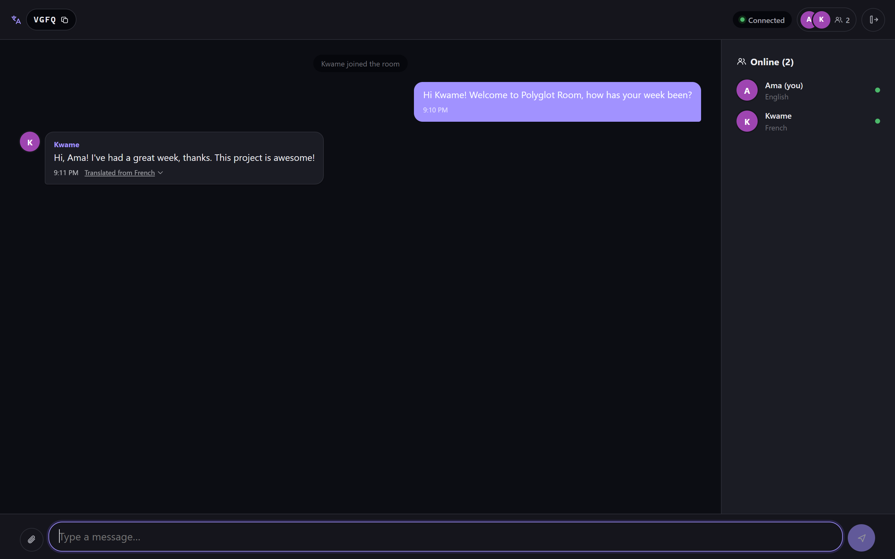
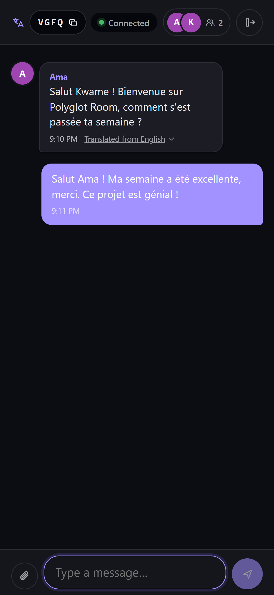
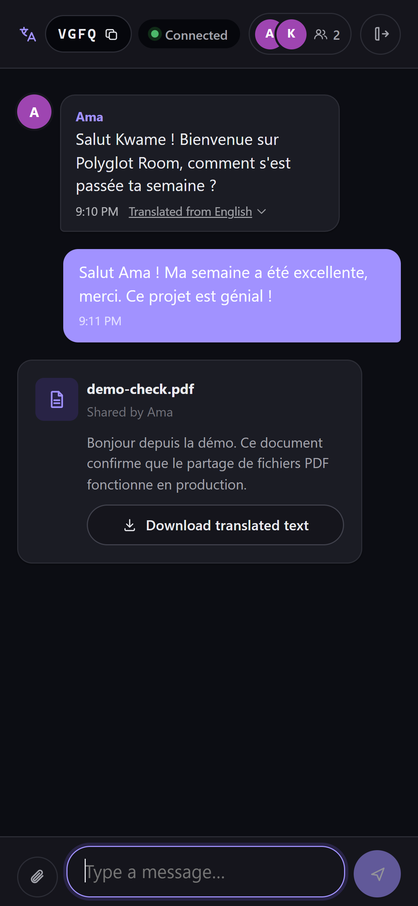

# Polyglot Room

**One conversation. Every language.**

Polyglot Room is a real-time chat platform where people who don't speak the same language can talk to each other naturally. Everyone types in their own language, and everyone else reads it in theirs. No common language required, no manual translation, no copy-pasting into a separate app.

Built as a final-year university project to demonstrate real-time systems (WebSockets), third-party API integration (machine translation), and a fully in-memory, privacy-first architecture (no database, no accounts, no history).

**Live demo:** [polyglot-room.pages.dev](https://polyglot-room.pages.dev)



## The idea

Group chats and video calls assume everyone shares a language. The moment that's not true, someone has to translate manually, paste text into Google Translate, or just get left out of the conversation.

Polyglot Room removes that step entirely. Each participant picks their own language once, when they join. From then on:

- **You** always type and read in your own language.
- **Everyone else** sees your messages auto-translated into theirs, the instant you send.
- A shared PDF gets extracted and translated for every participant individually too.

Nobody has to agree on a common language. Nobody has to switch tabs. The room does the translating.

## How it works

### 1. Create or join a room

A room is just a 4-character code, no sign-up, no email, no password. Whoever creates a room shares the code, and anyone with it can join and pick their own language.



### 2. Chat naturally, in your own language

Every message is translated individually for each participant, on arrival. The example below shows a live conversation between an English speaker and a French speaker, each reading the other's messages in their own language, with a label showing what was translated and from what:



The same conversation, from the French speaker's side, on a phone:



### 3. Share documents across languages too

Drop in a PDF and it's extracted and translated for every participant in the room, each into their own language, right in the chat:



## Key features

- **Real-time messaging** over WebSockets (Flask-SocketIO), with automatic reconnect and session restore on page reload.
- **Per-recipient translation** on every message, join/leave notification, and shared PDF, not a single shared translation for the whole room.
- **Multi-provider translation** with automatic fallback (DeepL, then Google, then MyMemory) so the app keeps working even if one provider is rate-limited.
- **PDF sharing** with server-side text extraction and per-participant translated output.
- **Zero persistence.** Rooms, messages, and documents live only in memory for as long as someone is in the room. The instant the last participant leaves, everything about that room is deleted. No database, no accounts, no chat history.
- **Fully responsive**, from a 320px phone to a widescreen desktop.
- **15 supported languages**, including two West African languages not covered by most mainstream translation tools: Twi and Ewe.

## Supported languages

English, French, German, Spanish, Portuguese, Italian, Dutch, Swedish, Arabic, Chinese (Simplified), Japanese, Korean, Hindi, Twi, and Ewe.

## Tech stack

**Backend:** Python, Flask, Flask-SocketIO (WebSockets), PyPDF2, deep-translator, gunicorn + eventlet, deployed on Render.

**Frontend:** React (Vite), Socket.IO client, deployed on Cloudflare Pages.

**Design:** No database by design. Room and message state lives entirely in the backend process's memory, matching the privacy goal of leaving no trace once a conversation ends.

## Running it locally

```bash
# Backend
cd backend
python -m venv venv
source venv/Scripts/activate   # or venv/bin/activate on macOS/Linux
pip install -r requirements.txt
cp .env.example .env
python run.py

# Frontend, in a separate terminal
cd frontend
npm install
cp .env.example .env
npm run dev
```

The frontend runs at `http://localhost:5173` and talks to the backend at `http://localhost:5000` by default.

## Project background

Built and delivered as a final-year computer science project, demonstrating a production-shaped real-time web application: a Flask/Socket.IO backend, a React frontend, third-party API integration with graceful multi-provider fallback, and a deliberately stateless, privacy-first data design.
